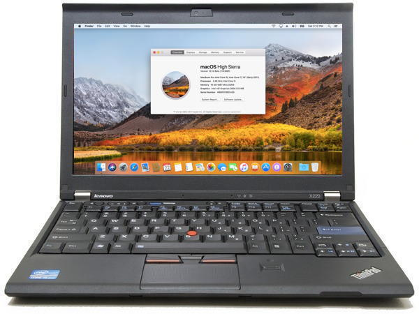

# Lenovo Thinkpad X220 OpenCore Adoption Guide



## Who is this repo for

Those who want to install ONLY `macOS` on their machine. If you intend to install other OSes as well, head to the [X220-Opencore-Dualboot](https://github.com/w43322/X220-OpenCore-Dualboot) repo.
Note that I have not forked that repo, and there are some differences between the upstream and the fork, see below.

## Differences from fork
- `ScanPolicy` set to 0 as with the version in the upstream.
- `itlwm` and `HoRNDIS` included for internet access on Intel cards.
- The `SSDT-PM` generated in the upstream did not work on my X220, and caused a kernel panic on boot. I generated my own and included it here, but if you get a kernel panic, disable it in `config.plist`.
- Special steps are required to create an installer as online installation of High Sierra doesn't work anymore.

## TLDR

### Flashing BIOS

1. Flash the modified BIOS under Windows. Instructions are provided in the zip file.

### Installing macOS

**As of 2023, the High Sierra recovery servers are no longer active, so the online installer you generate with Dortania's guide does not work.**
You can use [https://github.com/corpnewt/UnPlugged/blob/main/README.md](UnPlugged) to create an offline installer USB.

Replace the EFI folder on the first partition with the one provided in this repo. **If you recieve stepper errors on boot, disable `SSDT-PM` in `config.plist` until you can generate your own.**


#### Optimizing macOS

1. [Generate your own](https://dortania.github.io/OpenCore-Post-Install/universal/iservices.html) `Serial Number`, `MLB` and `UUID`, and populate `ROM` with the mac address of your Ethernet port.

2. The `SSDT-PM.aml` is generated using an `X220` with an `i5-2520M` processor. If you have a different processor, please [generate this file after install](https://dortania.github.io/OpenCore-Post-Install/universal/pm.html#sandy-and-ivy-bridge-power-management) and replace it. You may need to disable this entirely pre-install if you get stepper error kernel panics on boot.

3. If your `X220` has a `USB3.0` port, please [map the port](https://dortania.github.io/OpenCore-Post-Install/usb/) or it might not run at `USB3.0` speed.

## Additional Information

### Why can't one simply follow Dortania's Guide?

Well, I actually followed [Dortania's guide](https://dortania.github.io/OpenCore-Install-Guide/) to make this repo, but some modifications had to be made to make audio and battery readouts work.

1. `Misc -> Security -> SecureBootModel` is set to `Disabled`.

2. `UEFI -> APFS -> MinDate & MinVersion` are set to `-1` to allow `High Sierra` installation with `APFS`.

2. NVRAM emulation is `Enabled` by adjusting `config.plist` according to the following steps ([source](https://www.reddit.com/r/hackintosh/comments/wdugxf/how_to_opencore_082_083_differences/)):
```
* OpenRuntime.efi specified after OpenVariableRuntimeDxe.efi in the Drivers list
* OpenVariableRuntimeDxe.efi loaded using LoadEarly=true
* OpenRuntime.efi also loaded using LoadEarly=true for correct operation of * RequestBootVarRouting
* LegacySchema populated
* LegacyOverwrite enabled to be able to overwrite any existing variable
* ExposeSensitiveData with at least bit 0x1 set
* This driver requires working FAT write support in firmware, and sufficient free space on the OpenCore EFI partition for up to three saved NVRAM files
* NVRAM values are loaded from NVRAM/nvram.plist
* Reset NVRAM option installed by the ResetNvramEntry driver removes NVRAM/nvram.plist instead of affecting underlying NVRAM
* CTRL+Enter in the OpenCore bootpicker updates or creates NVRAM/nvram.plist.
```

4. Using `DSDT.aml` from [mcdonnelltech](httpshttps://x220.mcdonnelltech.com//) to fix audio and battery readouts, instead of custom `SSDT`s.
I know this is not a good practice, but currently I can't spare the time and energy to reverse engineer every patch done to the `DSDT` and make seperate `SSDT` patches.
If the custom `SSDT`s are made, we can ditch `rEFInd` and use `OpenCore` to boot all OSes, which is a lot cleaner.
If anyone is interested in doing this, you're welcomed to fork this repo or create PRs.

5. ITLWM is included, however you will need to install HeliPort to get WiFi to work.

### Binary Versions

| Binary               | Version / Source |
| -------------------- | ---------------- |
| Modified 1.46 BIOS   | from [mcdonnelltech](https://x220.mcdonnelltech.com/) |
| OpenCore             | 0.8.4            |
| Lilu                 | 1.6.2            |
| AppleALC             | 1.7.5            |
| WhateverGreen        | 1.6.1            |
| VirtualSMC & modules | 1.3.0            |
| VoodooPS2Controller  | Modded from [mcdonnelltech](https://x220.mcdonnelltech.com/) |
| DSDT.aml             | from [mcdonnelltech](https://x220.mcdonnelltech.com/) |
| SSDT-PM.aml          | Generated using [ssdtPRGen](https://github.com/Piker-Alpha/ssdtPRGen.sh) on X220 / i5-2520M |
